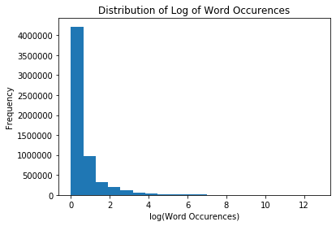
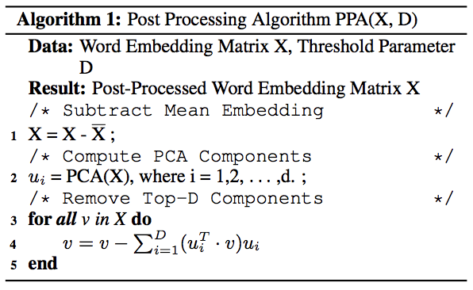
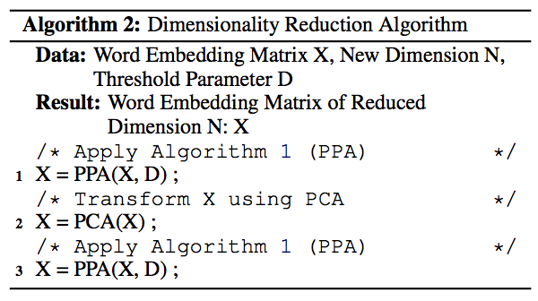
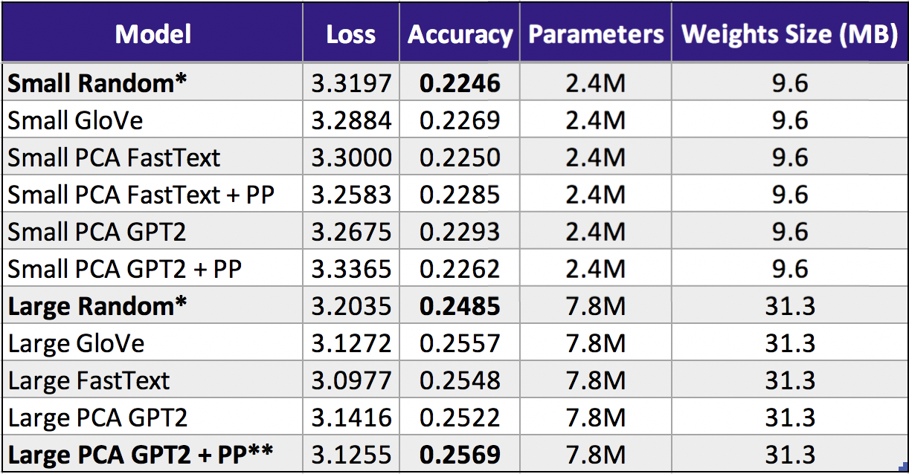

# Final Research Report
##### DATA 591 at University of Washington in Collaboration with Google

- 03-11-2020
- [Arjun Singh\*](https://github.com/sinarj), [Joel Stremmel\*](https://github.com/jstremme)
- Special thanks to Keith Rush and Peter Kairouz from Google for their guidance throughout the course of this project.

### Introduction
While training on centralized data is the dominant paradigm in machine learning, there are a variety of limitations to centralized model training, such as compromised user privacy and maintenance of expensive compute resources.  Federated learning aims to address these challenges and has exhibited promising results for [text completion tasks on mobile devices](https://arxiv.org/pdf/1811.03604.pdf). The [Tensorflow Federated API](https://github.com/tensorflow/federated) is a programming interface for training federated models and conducting federated learning experiments on data grouped by individual clients but never centrally aggregated.  Through our research partnership with the Tensorflow Federated team at Google, we build on the existing body of federated learning experiments, focussing on enhancing the accuracy and reducing the size and training time constraints of federated text models for next word prediction.

### Enhancing Federated Text Models with Pretraining Methods
Federated learning trains machine learning models in a distributed fashion without centralizing data but instead updating and passing model parameters from a central server to distributed entities and back to perform stochastic gradient descent.  McMahan et al. propose the Federated Averaging algorithm in ["Communication-Efficient Learning of Deep Networks from Decentralized Data."](https://arxiv.org/pdf/1602.05629.pdf)  In this research we replicate a baseline network architecture for next word prediction using the Federated Averaging algorithm to train an LSTM on the Stack Overflow dataset, then apply three enhancements to federated training with this architecture, demonstrating increased accuracy with fewer required training rounds.  Our enhancements include:

1. Centrally pretraining deep neural network models then fine tuning them in the federated setting.
2. Incorporating pretrained word embeddings instead of randomly initialized embeddings and fine tuning these embeddings while training the full network in the federated setting.
3. Combining centralized pretraining and pretrained word embeddings with federated fine tuning.

The following sections detail the methods we apply to demonstrate these enhancements as well as our experimental results.  All code for this research is freely available under the MIT License [at this address](https://github.com/federated-learning-experiments/fl-text-models).

### Data
The main dataset used for these experiments is hosted by Kaggle and made available through the [tff.simulation.datasets module in the Tensorflow Federated API](https://www.tensorflow.org/federated/api_docs/python/tff/simulation/datasets/stackoverflow/load_data).  Stack Overflow owns the data and has released the data under the [CC BY-SA 3.0 license](https://creativecommons.org/licenses/by-sa/3.0/).  The Stack Overflow data contains the full body text of all Stack Overflow questions and answers along with metadata, and the API pointer is updated quarterly.  The data is split into the following sets at the time of writing:

- Train: 342,477 distinct users and 135,818,730 examples.
- Validation: 38,758 distinct users and 16,491,230 examples.
- Test: 204,088 distinct users and 16,586,035 examples.

The [EDA notebook linked here](https://github.com/federated-learning-experiments/fl-text-models/blob/master/eda/stack_overflow_eda.ipynb) contains an exploratory analysis of the data with example records and visualizations.  From this notebook we deduce that challenges with the data include:

- The size of the data, as it would be nearly impossible to inspect all samples.
- The distribution of words.  As is common with text data, the most common words occur with frequency far greater than the least common words (see [Zipf's Law](https://en.wikipedia.org/wiki/Zipf%27s_law)).

Therefore, in our experiments, we limit the vocab size to exclude very rare words, accepting that even state of the art language models fail at next word prediction when the next word is rare.  Note the distribution below for the log of the number of word occurences:

For the task of model pretraining, we also leverage the collected works of Shakespeare from Project Gutenberg released under the [Project Gutenberg license](https://www.gutenberg.org/wiki/Gutenberg:The_Project_Gutenberg_License).  We download the full text of these collected works totaling 124,788 lines from [this url]('http://www.gutenberg.org/files/100/old/1994-01-100.zip').

### Model Design
In this study, we train a variety of small and large neural networks with four layers each as follows:

|Size | Embedding Size | LSTM Size                | Dense Layer | Output Layer |
|-----|----------------|--------------------------|-------------|--------------|
|Small| 100            | 256                      | 100         | 10004        |
|Large| 300            | 512                      | 300         | 10004        |

The output layer represents the top 10,000 most frequently occuring vocab words in the Stack Overflow dataset plus four special tokens used during traing denoting: padding, beginning of a sentence, end of a sentence, and out of vocabulary.  We report accuracy with and without these tokens included.

We train both networks using the Adam optimizer and Sparse Categorical Crossentropy loss for batches of size 16 and compare train and validation accuracy at each training round for 800 training rounds by sampling 10 non-IID client datasets per round.  Each client dataset has 5,000 text samples from Stack Overflow at maximum, and a total of 20,000 validation samples.  Model parameters are averaged centrally after each federated training round and the contribution of each client dataset to the Sparse Categorical Crossentropy loss function is weighted by the number of text samples drawn from each client.  See the distribution of the number of text samples taken over 800 training rounds from one of our experiments below:

While training each network, we save the model weights from the training round that produced the highest validation set accuracy and conduct a final performance evaluation on 1,000,000 test samples. All models are trained with the Federated Averaging algorithm as in [McMahan et. al.](https://arxiv.org/pdf/1602.05629.pdf) using the [Tensorflow Federated](https://github.com/tensorflow/federated) simulated training environment.  The large network outperforms the smaller network though has about three times the number of trainable parameters (7,831,328 vs 2,402,072) and is about three times as big (31.3MB vs 9.6MB).  The large network is depicted here:

### Central Pretraining with Federated Fine Tuning

The communication and computation costs of training models across distributed devices necessitates limiting the number of federated training rounds as much as possible.  Transfer learning provides a way to trade computation time on independent devices for computation time on a cenrtal server.  In this way, we propose that by initializing weights for a model to be trained on federated, private data with pretrained weights learned from centralized, public data, it is possible to limit training rounds on distributed devices, as the federated model will begin training with some information about autoregressive word order.  We recognize that the English in Shakespeare differs greatly from the English in Stack Overflow posts, and therefore submit that the value of our work is mostly mechanical in nature, that is, we provide a simple method to extract weights learned from a centrally trained model and apply them to a model to be trained in the federated setting.

To pretrain our federated model, we first load, preprocess, and fit a model to the Shakespeare data using the [tf.keras](https://www.tensorflow.org/api_docs/python/tf/keras) module from Tensorflow.  In doing so, we fit the same model architecture as described above for federated training but to the entire dataset for a predefined number of pretraining rounds.  We then extract the tensors of model weights from the trained model and use these layer tensors to initialize the federated model.  For the embedding layer, we use one of the methods described in the following section on word embeddings which include either random or pretrained embeddings.  Words in the Shakespeare dataset that do not map to pretrained word embeddings are initialized by drawing floating points from the random uniform distribution on the interval [-0.05, 0.05].  We apply this same method of filling in missing words when using pretrained word embeddings for federated training on Stack Overflow.

Starting with randomly intialized word embeddings and pretraining our large network on Shakespeare with fine tuning on Stack Overflow yields the following results:

### Pretrained Word Embeddings for Federated Training
Using pretrained word embeddings to introduce information about word co-occurence into a model is a common method for reducing training time and increasing predictive accuracy (see [pretrained word embeddings in Keras](https://blog.keras.io/using-pre-trained-word-embeddings-in-a-keras-model.html)).  We hypothesize that having a common, starting representation for words across federated (non-IID) datasets yields improved model performance with fewer training rounds compared to federated training with randomly initialized word embeddings.  To test this, we consider a variety of pretained word embeddings including [GloVe](https://nlp.stanford.edu/pubs/glove.pdf), [FastText](https://arxiv.org/abs/1712.09405), and [GPT2](https://cdn.openai.com/better-language-models/language_models_are_unsupervised_multitask_learners.pdf) for both our small and large network architectures.  These methods of pretraining word embeddings vary in implementation (see the papers for each), capturing different information about how words co-occur.  In practice each embedding method exposes a preselected vocabulary with vector representations for each word, and can thus be compared on the basis of how these vector representations enable various downstream tasks.  For the present task of next word prediction, we expect the GPT2 embeddings, trained in an autoregressive fashion for next word prediction, to encode especially relevant information for our task at hand of predicting the next word in Stack Overflow posts.  We retrieve GPT2 embeddings from the [HuggingFace Transformers Library](https://arxiv.org/abs/1910.03771).

While GloVe embeddings are commonly used and come in a variety of dimmensions (50, 100, 200, 300), FastText and GPT2 embeddings are limited to a handful of sizes.  We test the 100 and 300 dimmensional GloVe embeddings in the small and large networks repsectively and the 300 dimmensional FastText embeddings in the large nework.  To create 100 dimmensional FastText embeddings as well as 100 and 300 dimmensional GPT2 embeddings from the smallest available GPT2 embeddings of size 768, we use two methods.  First, we apply principle Principal Components Analysis to reduce these word embeddings to the desired dimmensions of 100 and 300 and include these word embeddings in our experiment runts.  Second, we run the same experiments but achieve 100 and 300 dimmensional FastText and GPT2 embeddings using Principle Components Analysis with the dimmensionality reduction algorithm from [Raunak et. al](https://www.aclweb.org/anthology/W19-4328.pdf).  This dimmensionality reduction algorithm leverages the post-processing algorithm from [Mu and Viswanath](https://openreview.net/forum?id=HkuGJ3kCb) which works as follows:

The intuition is that word embeddings share the same mean as well as dominating principle components, that is, the dominating principle compnents describe similar variation across the embedding space, and therefore do little to help distinguish between embedding representations.  Raunak et. al demonstrate that while the post-processing algorithm eliminates dominating components, applying post-processing before and after applying Principle Components Analysis further purifies word embeddings.  This appraoch (algorithm below) achieves increased performance on word similarity benchmark compared to the post-processing algorithm alone.

We leverage this second algorithm to create word embeddings used for federated next word prediction with aforementioned model architectures and achieve the following validation set accuracy over 800 training rounds where "PP PCA PP" denotes algorithm two (in which post-processing is applied before and PCA) and D=7 (as in Raunak et. al).  Note here that we plot validation accuracy from many runs where validation accuracy includes end of sentence and out of vocab tokens.  The test accuracy without these tokens included is reported in a table to follow.  See first the small network validation set accuracy across a variety of word embedding representations:

In these small networks, it is apparent that the GloVe embeddings start to gain accuracy ahead of all other approaches.  The randomly initialized embeddings require more training rounds to achieve the same level of accuracy early on with slightly worse performance in later rounds compared to the pretrained methods.  These differences are more pronounced in the large networks:

From the small and large networks we observe that pretrained word embeddings achieve the same level of accuracy sooner, that is, with fewer training rounds compared to random embeddings.  This early boost in performance is valuable in the federated setting in the sense that these embeddings will take up no more space than random embeddings and help the model approach peak accuracy with fewer training rounds, each of which requires communication between the server averaging model parameters and the training clients.  

Comparing the models trained with these word embeddings on the test set with 1 million text samples, we observe an increase of over half a percent accuracy with pretrained compared to random embeddings for the larger networks with little to no improvement from pretrained embeddings for the smaller networks.

|*              | **       |
|---------------|----------|
|Random Baseline|Best Model|

We highlight the large network GPT2 word embeddings with reduced dimension via Algorithm 2 as the best performing approach in terms of accuracy, both with and without end of sentence and out of vocab tokens.

### Federated Fine Tuning Using a Pretrained Model with Pretrained Word Embeddings

While both model pretraining and starting with pretrained word embeddings provide ways of kicking off federated training with a more intelligent model, it is natural to combine the two approaches.  In doing so we observe the following results:

### Conclusions and Future Work
While our initial research demonstrates the possibility of reducing the number of federated training rounds required to achieve acceptable model accuracy through the use of pretrained word embeddings, there is much left to explore, particularly for central pretraining with federated fine tuning, for which we demonstrate a viable procedure but do not achieve performance greater than the federated training baseline. That said, this approach may be fruitful with pretraining data more similar to Stack Overflow than the collected works of Shakespeare.  Also, for both model pretraining and pretrained word embedding approaches, learning rate optimization as in ["Adaptive Federated Optimization"](https://arxiv.org/pdf/2003.00295.pdf) may help address the specific optimization requirements of fine tuning weights that have already undergone some training.  Additionally, using federated simulation to conduct pretraining, such that the initial model weights are learned on non-IID datasets, may improve overall model performance after federated fine tuning.  Simulating federated training conditions to train word embeddings may also yield improved downstream performance by tailoring word representations to reflect different usage across non-IID datasets.  Finally, while GPT2 and other Transformer-based models are achieving state of the art performance on centralized language modeling tasks, the sizes of these models are prohibitively large for federated training and prediction.  While leveraging the embeddings learned from these models for federated training can be immediately useful, as demonstrated here, the ability to reduce the size of these models and train them end to end in a federated way would likely yield state of the art results for federated next word prediction and other natural language understanding tasks.

### References
This project draws mainly from the following research, but other sources are referenced throughout this repository, particularly code snippets.

-	H. Brendan McMahan, Eider Moore, Daniel Ramage, Seth Hampson, Blaise Aguera y Arcas. [“Communication-Efficient Learning of Deep Networks."](https://arxiv.org/pdf/1602.05629.pdf) Accessed December 6, 2019.
- Keith Bonawitz, Hubert Eichner, Wolfgang Grieskamp, Dzmitry Huba, Alex Ingerman, Vladimir Ivanov, Chloe Kiddon, Jakub Konecny, Stefano Mazzocchi, H. Brendan McMahan, Timon Van Overveldt, David Petrou, Daniel Ramage, Jason Roselander. [“Towards Federated Learning at Scale: System Design.”](https://arxiv.org/pdf/1902.01046.pdf) Accessed December 6, 2019.
- Andrew Hard, Kanishka Rao, Rajiv Mathews, Swaroop Ramaswamy, Francoise Beaufays Sean Augenstein, Hubert Eichner, Chloe Kiddon, Daniel Ramage. [“Federated Learning for Mobile Keyboard Prediction.”](https://arxiv.org/pdf/1811.03604.pdf) Accessed December 6, 2019.
- Sashank J. Reddi, Zachary Charles, Manzil Zaheer, Zachary Garrett, Keith Rush, Jakub Konecný, Sanjiv Kumar, H. Brendan McMahan. ["Adaptive Federated Optimization"](https://arxiv.org/pdf/2003.00295.pdf) Accessed March 6, 2020.
- Jeffrey Pennington, Richard Socher, and Christopher D. Manning. ["GloVe: Global Vectors for Word Representation."](https://nlp.stanford.edu/pubs/glove.pdf) Accessed February 1, 2020.
- T. Mikolov, E. Grave, P. Bojanowski, C. Puhrsch, A. Joulin. ["Advances in Pre-Training Distributed Word Representations."](https://arxiv.org/abs/1712.09405) Accessed February 17, 2020.
- Jiaqi Mu, Pramod Viswanath ["All-but-the-Top: Simple and Effective Postprocessing for Word Representations"](https://openreview.net/forum?id=HkuGJ3kCb).  Accessed March 05, 2020.
- Vikas Raunak, Vivek Gupta, Florian Metze. ["Effective Dimensionality Reduction for Word Embeddings"](https://www.aclweb.org/anthology/W19-4328.pdf). Accessed March 05, 2020.
- Vikas Raunak, Vaibhav Kumar, Vivek Gupta, Florian Metze. ["On Dimensional Linguistic Properties of the Word Embedding Space."](https://arxiv.org/pdf/1910.02211.pdf) Accessed February 27, 2020.
- Alec Radford, Jeffrey Wu, Rewon Child, David Luan, Dario Amodei, Ilya Sutskever. ["Language Models are Unsupervised Multitask Learners."](https://cdn.openai.com/better-language-models/language_models_are_unsupervised_multitask_learners.pdf) Accessed February 27, 2020.
- Thomas Wolf, Lysandre Debut, Victor Sanh, Julien Chaumond, Clement Delangue, Anthony Moi, Pierric Cistac, Tim Rault, Rémi Louf, Morgan Funtowicz, Jamie Brew. ["HuggingFace's Transformers: State-of-the-art Natural Language Processing"](https://arxiv.org/abs/1910.03771).  Accessed March 05, 2020.
