# Final Research Report
##### DATA 591 at University of Washington in Collaboration with Google

- 03-13-2020
- [Arjun Singh\*](https://github.com/sinarj), [Joel Stremmel\*](https://github.com/jstremme)
- Special thanks to Peter Kairouz and Keith Rush from Google for their guidance throughout the course of this project.
- See our [white paper](https://arxiv.org/abs/2005.04828) for further details on related work, experiment designs, and results.

### Introduction
Machine learning on big data is an extremely popular and useful field of research and development. However, there are a variety of limitations to centrally aggregating data, such as compromising user privacy and the maintenance of often expensive hardware and compute resources. Federated learning aims to address this and has exhibited promising results for text completion tasks on mobile devices [[3]](https://arxiv.org/pdf/1811.03604.pdf). The [Tensorflow Federated API](https://github.com/tensorflow/federated) [[2]](https://arxiv.org/pdf/1902.01046.pdf) provides methods to train federated models and conduct federated learning experiments on data grouped by clients but never aggregated. Through our research partnership with the Tensorflow Federated team at Google, we build on the existing body of federated learning experiments, focusing on enhancing the accuracy and reducing the size and training time constraints of federated text models for next word prediction.

### Enhancing Federated Text Models with Pretraining Methods
Federated learning trains machine learning models in a distributed fashion without centralizing data but instead updating and passing model parameters from a central server to distributed entities and back to perform stochastic gradient descent.  McMahan et al. propose the Federated Averaging algorithm in "Communication-Efficient Learning of Deep Networks from Decentralized Data" [[1]](https://arxiv.org/pdf/1602.05629.pdf) which averages model parameters after applying gradient updates to local models based on individual client datasets.  In this research we replicate a baseline network architecture for next word prediction using the Federated Averaging algorithm to train an LSTM [[12]](https://www.researchgate.net/profile/Sepp_Hochreiter/publication/13853244_Long_Short-term_Memory/links/5700e75608aea6b7746a0624/Long-Short-term-Memory.pdf) on the Stack Overflow dataset which is split into client datasets by user.  We then apply three enhancements to federated training with this architecture, demonstrating increased top-1 accuracy with fewer required training rounds.  Our enhancements include:

1. Centrally pretraining deep neural network models, followed by fine-tuning them in the federated setting.
2. Incorporating pretrained word embeddings instead of randomly initialized embeddings and fine-tuning these embeddings while training the full network in the federated setting.
3. Combining centralized pretraining and pretrained word embeddings with federated fine-tuning.

The following sections detail the methods we apply to achieve these enhancements as well as our experimental results.  All code for this research is freely available under the MIT license [at this address](https://github.com/federated-learning-experiments/fl-text-models).

### Data
The main dataset used for these experiments is hosted by Kaggle and made available through the [tff.simulation.datasets module](https://www.tensorflow.org/federated/api_docs/python/tff/simulation/datasets/stackoverflow/load_data) in the Tensorflow Federated API [[2]](https://github.com/tensorflow/federated).  Stack Overflow owns the data and has released the data under the [CC BY-SA 3.0 license](https://creativecommons.org/licenses/by-sa/3.0/).  The Stack Overflow data contains the full body text of all Stack Overflow questions and answers along with metadata, and the API pointer is updated quarterly.  The data is split into the following sets at the time of writing:

- Train: 342,477 distinct users and 135,818,730 examples.
- Validation: 38,758 distinct users and 16,491,230 examples.
- Test: 204,088 distinct users and 16,586,035 examples.

The [EDA notebook linked here](https://github.com/federated-learning-experiments/fl-text-models/blob/master/eda/stack_overflow_eda.ipynb) contains an exploratory analysis of the data with example records and visualizations.  From this notebook we deduce that challenges with the data include:

- The size of the data, as it would be nearly impossible to inspect all samples.
- The distribution of words.  As is common with text data, the most common words occur with frequency far greater than the least common words (see [Zipf's Law](https://en.wikipedia.org/wiki/Zipf%27s_law)).

Therefore, in our experiments, we limit the vocab size to exclude very rare words, accepting that even state of the art language models fail at next word prediction when the next word is rare.  Note the distribution below for the log of the number of word occurrences:

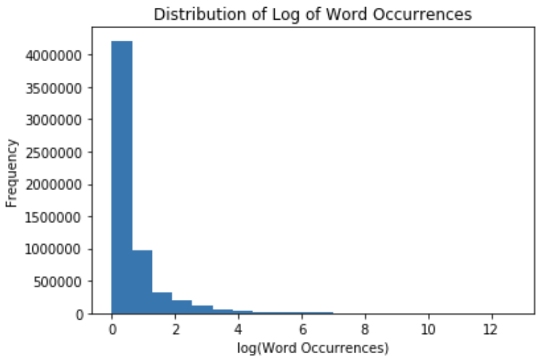

For the task of model pretraining, we also leverage the collected works of Shakespeare from Project Gutenberg released under the [Project Gutenberg license](https://www.gutenberg.org/wiki/Gutenberg:The_Project_Gutenberg_License).  We download the full text of these collected works totaling 124,788 lines from [this url](http://www.gutenberg.org/files/100/old/1994-01-100.zip).

### Model Design
In this study, we train a variety of small and large neural networks with four layers each as follows:

|Size | Embedding Size | LSTM Size                | Dense Layer | Output Layer |
|-----|----------------|--------------------------|-------------|--------------|
|Small| 100            | 256                      | 100         | 10,004        |
|Large| 300            | 512                      | 300         | 10,004        |

The output layer represents the top 10,000 most frequently occurring vocab words in the Stack Overflow dataset plus four special tokens used during training denoting: padding, beginning of a sentence, end of a sentence, and out of vocabulary.  We report accuracy with and without these tokens included.

We train both networks using the Adam optimizer and Sparse Categorical Cross Entropy loss for batches of size 16 and compare train and validation accuracy at each training round for 800 training rounds by sampling 10 non-IID client datasets per round, though we run some initial tests with 500 training rounds and a final test with 1,500.  Each client dataset has 5,000 text samples from Stack Overflow at maximum, and a total of 20,000 validation samples.  Model parameters are averaged centrally after each federated training round and the contribution of each client dataset to the Sparse Categorical Cross Entropy loss function is weighted by the number of text samples drawn from each client.  We do not apply additional training rounds on the client datasets before averaging parameters and for this reason use the terminology of rounds and epochs interchangeably. See the distribution of the number of text samples taken over 800 training rounds from one of our experiments below:

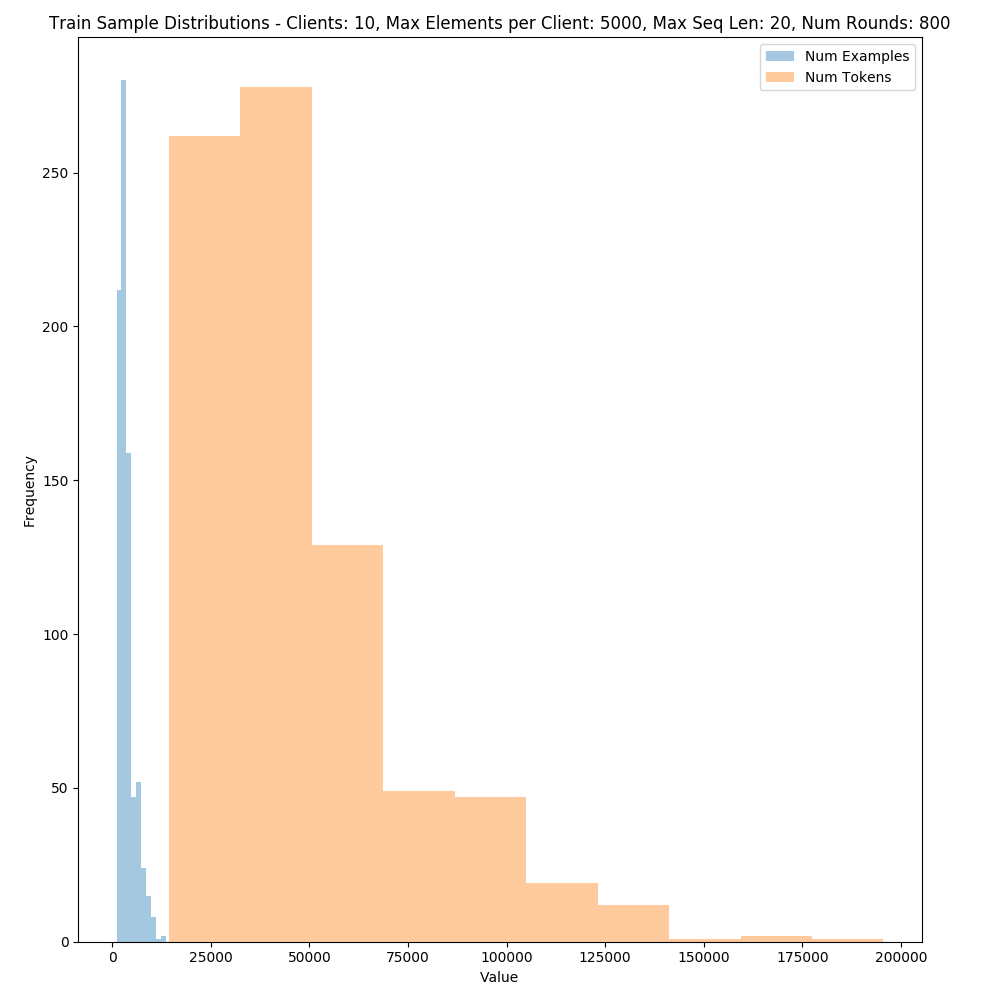

While training each network, we save the model weights from the training round that produced the highest validation set accuracy and conduct a final performance evaluation on 1,000,000 test samples.  All models are trained with the Federated Averaging algorithm as in [[1]](https://arxiv.org/pdf/1602.05629.pdf) using the [Tensorflow Federated](https://github.com/tensorflow/federated) simulated training environment from [[2]](https://arxiv.org/pdf/1902.01046.pdf).  The large network outperforms the small network but with about three times the number of trainable parameters (7,831,328 vs 2,402,072) and is about three times the size (31.3MB vs 9.6MB).  The large network is depicted here:

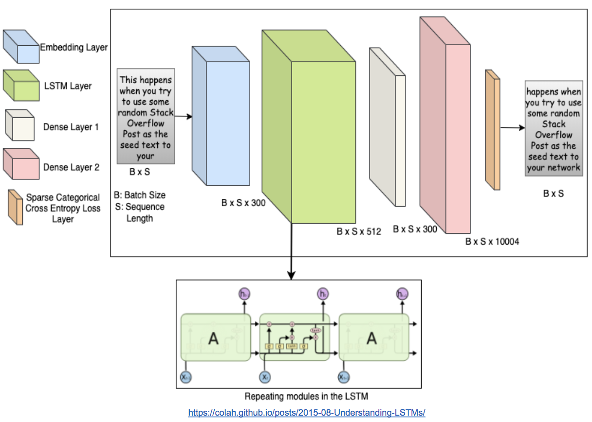

### Central Pretraining with Federated Fine-Tuning
The communication and computation costs of training models across distributed devices necessitates limiting the number of federated training rounds as much as possible.  Transfer learning provides a way to trade computation time on independent devices for computation time on a central server.  In this way, we propose that by initializing weights for a model to be trained on federated, private data with pretrained weights learned from centralized, public data, it is possible to limit training rounds on distributed devices, as the federated model will begin training with some information about the sequence of words, i.e., which word should follow the text observed so far.  We recognize that the English in Shakespeare differs greatly from the English in Stack Overflow posts, and therefore submit that the value of our work is mostly mechanical in nature, that is, we provide a simple method to extract weights learned from a centrally trained model and apply them to a model to be trained in the federated setting.

To centrally pretrain our federated model, we first load, preprocess, and fit a model to a pretraining dataset using the [tf.keras](https://www.tensorflow.org/api_docs/python/tf/keras) module from Tensorflow.  In doing so, we fit the same model architecture as described above for federated training but to the entire dataset for a predefined number of pretraining rounds.  We then extract the tensors of model weights from the trained model and use these layer tensors to initialize the federated model. In the results to follow we pretrain either on Shakespeare or Stack Overflow.  

For Stack Overflow, we use distinct samples for pretraining and fine-tuning to avoid overfitting and derive these samples from the train, validation, and test sets from the Tensorflow Federated [datasets API](https://www.tensorflow.org/federated/api_docs/python/tff/simulation/datasets/stackoverflow/load_data), pretraining on the test set and reporting validation set performance during fine-tuning on the train set.  Words that do not map to embeddings learned during pretraining are initialized by drawing floating points from the random uniform distribution on the interval [-0.05, 0.05].  We apply this same method of filling in missing words when using pretrained word embeddings for federated training on Stack Overflow which we describe in the next section.

Starting with randomly initialized word embeddings and pretraining our small network as described above with fine-tuning on Stack Overflow yields the following results:

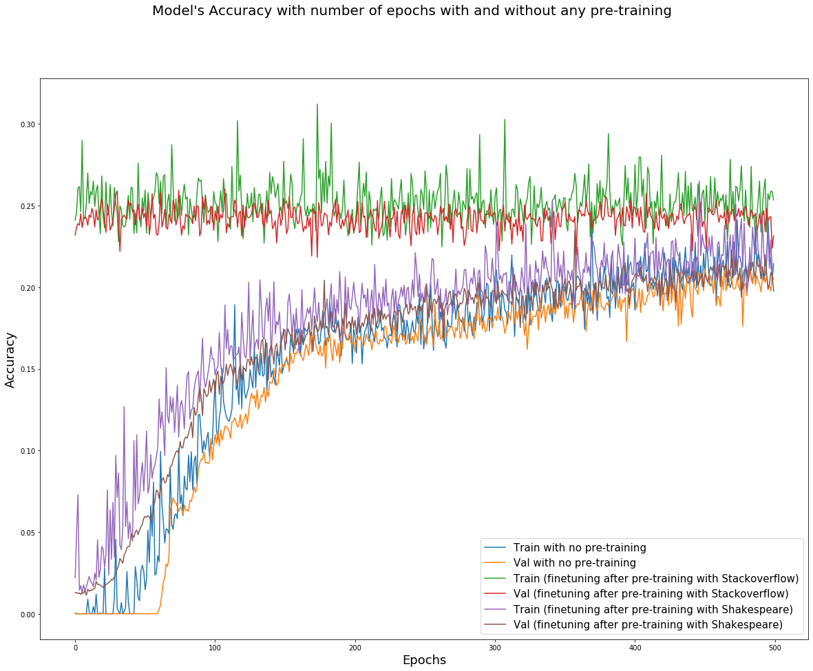

As can be seen from the graph above, there are three different models that were fine-tuned in the federated style for 500 rounds. Although the network remains the same for all three, the key difference is whether they were pretrained. The three models are as follows:

**1. Federated training on Stack Overflow without any pretraining**

The two learning curves that correspond to the case without any pretraining exhibit the lowest levels of train and validation accuracy. 

**2. Central pretraining on Shakespeare followed by federated fine-tuning on Stack Overflow**

The curves for the model pretrained centrally using Shakespeare get a marginal lift.  Here we witness some benefit of pretraining for 50 rounds.

**3. Central pretraining on a subset of Stack Overflow followed by federated fine-tuning on a distinct subset of Stack Overflow**

The curves with the highest accuracy, correspond to the ones which were pretrained using separate IDs from the Stack Overflow data. However, there is hardly any benefit of fine-tuning here, because the accuracy is consistent between the first few epochs as well as the last few epochs of training.

The two main takeaways from this experiment are as follows:

1. Pretraining generally improves the performance of fine-tuning.
2. When the source of data is identical for pretraining and fine-tuning, fine-tuning adds no value. 

We must also note that for the latter case, it may not be practically possible to have the same source of data for pretraining, performed centrally on a server, and fine-tuning, performed in the federated style on user devices. 

### Pretrained Word Embeddings for Federated Training
Using pretrained word embeddings to introduce information about word co-occurrence into a model is a common method for reducing training time and increasing predictive accuracy (see [pretrained word embeddings in Keras](https://blog.keras.io/using-pre-trained-word-embeddings-in-a-keras-model.html)).  We hypothesize that having a common, starting representation for words across federated (non-IID) datasets yields improved model performance with fewer training rounds compared to federated training with randomly initialized word embeddings.  To test this, we consider a variety of pretrained word embeddings including GloVe [[4]](https://nlp.stanford.edu/pubs/glove.pdf), FastText [[5]](https://arxiv.org/abs/1712.09405), and GPT2 [[6]](https://cdn.openai.com/better-language-models/language_models_are_unsupervised_multitask_learners.pdf) for both our small and large network architectures.  These methods of pretraining word embeddings vary in implementation, capturing different information about how words co-occur.  In practice each embedding method exposes a preselected vocabulary with vector representations for each word, and can thus be compared on the basis of how these vector representations enable various downstream tasks.  For the present task of next word prediction, we expect the GPT2 embeddings, trained in an autoregressive fashion for next word prediction, to encode especially relevant information for our task at hand of predicting the next word in Stack Overflow posts.  We retrieve GPT2 embeddings from the HuggingFace Transformers Library [[11]](https://arxiv.org/abs/1910.03771).

While GloVe embeddings are commonly used and come in a variety of dimensions (50, 100, 200, 300), FastText and GPT2 embeddings are limited to a handful of sizes.  We test the 100 and 300-dimensional GloVe embeddings in the small and large networks respectively and the 300-dimensional FastText embeddings in the large network.  To create 100 dimensional FastText embeddings as well as 100 and 300-dimensional GPT2 embeddings from the smallest available GPT2 embeddings of size 768, we use two methods.  First, we apply Principal Components Analysis to reduce these word embeddings to the desired dimensions of 100 and 300 and include these word embeddings in our experiment runs.  Second, we run the same experiments but achieve 100 and 300-dimensional FastText and GPT2 embeddings using Principal Components Analysis with the Dimensionality Reduction Algorithm from Raunak et al. [[8]](https://www.aclweb.org/anthology/W19-4328.pdf).  This algorithm applies the post-processing algorithm from Mu and Viswanath [[7]](https://openreview.net/forum?id=HkuGJ3kCb) which subtracts the mean vector from all word vectors as well as the directions of variation explained by the top D principal components as follows:

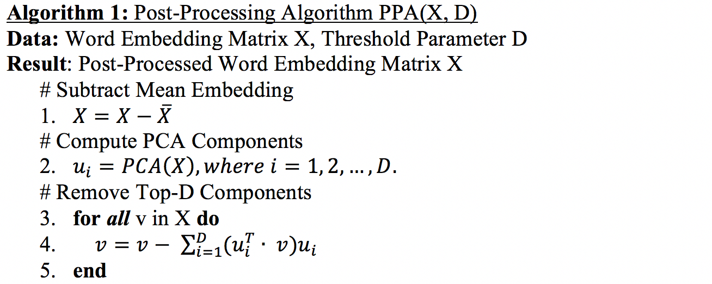

The intuition behind this approach is that the mean vector for a set of word embeddings as well as the dominating principal components describe variation that is common across the embedding space, and therefore do little to help distinguish between individual word representations. While Mu and Viswanath demonstrate that the post-processing algorithm yields improved performance on a variety of word similarity tasks by purifying word embedding representations, Raunak et al. demonstrate the benefits of applying post-processing before and after dimensionality reduction via principal components. This dimensionality reduction approach (algorithm below) achieves further performance improvement on some word similarity benchmarks compared to the post-processing algorithm alone, while across word similarity benchmarks achieving at least equal performance on a majority of tasks but with significantly smaller embeddings.

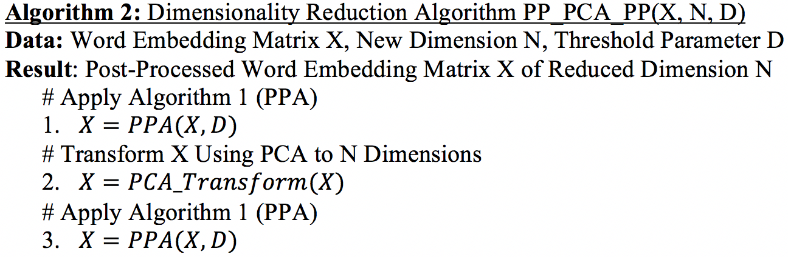

Raunak et al. provide an example of how further post-processing eliminates the dominating effects of the top principal components which remain even after initial post-processing with the following example.  See the variance explained by the top 20 principal components for 300-dimensional GloVe embeddings before and after applying the post-processing algorithm (images from [[8]](https://www.aclweb.org/anthology/W19-4328.pdf)).

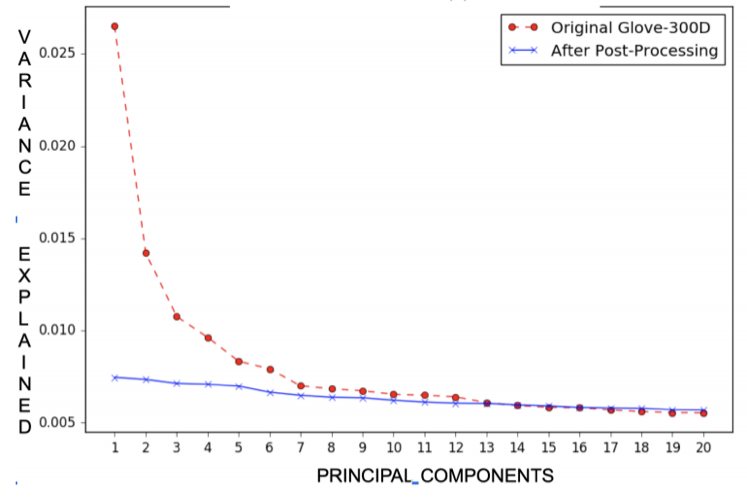

And then again after applying dimensionality reduction with a PCA transformation to 150 dimensions and another round of post-processing.  This eliminates the dominating effects of the new top principal components, making the reduced word vectors more discriminative.

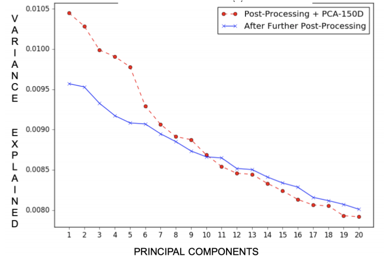

We apply the Demonsionality Reduction Algorithm from [[8]](https://www.aclweb.org/anthology/W19-4328.pdf) to create word embeddings used for federated next word prediction with the aforementioned model architectures and achieve the following validation set accuracy over 800 training rounds where "PP PCA PP" denotes algorithm two (in which post-processing is applied before and after PCA) and D=7 (as in [[8]](https://www.aclweb.org/anthology/W19-4328.pdf) but also based on plotting variance explained for our word vectors).  Here accuracy includes end of sentence and out of vocab tokens.  The test accuracy without these tokens included is reported in a table to follow.  See first the small network validation accuracy across a variety of word embedding representations:

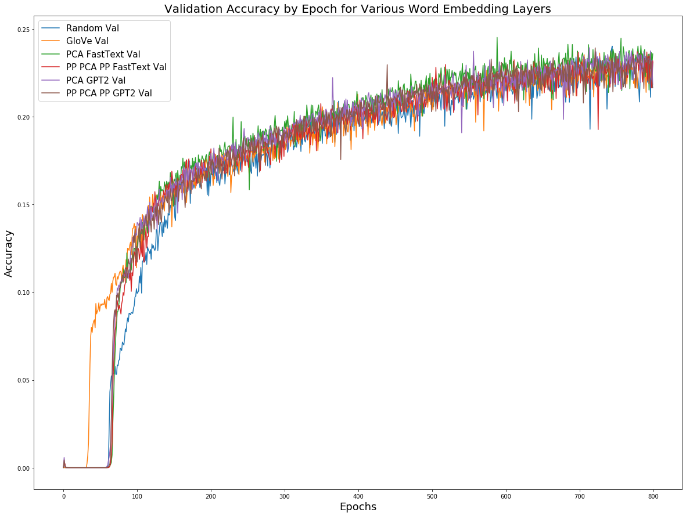

In these small networks, it is apparent that the GloVe embeddings start to gain accuracy ahead of all other approaches.  The randomly initialized embeddings require more training rounds to achieve the same level of accuracy early on with slightly worse performance in later rounds compared to the pretrained methods.  These differences are more pronounced in the large networks:

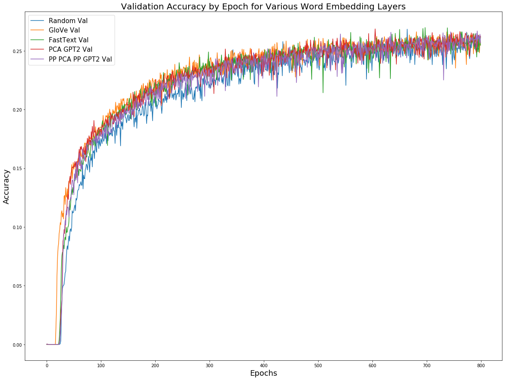

From the small and large networks we observe that pretrained word embeddings achieve the same level of accuracy sooner, that is, with fewer training rounds compared to random embeddings.  This early boost in performance is valuable in the federated setting in the sense that these embeddings will take up no more space than random embeddings and help the model approach peak accuracy with fewer training rounds, each of which requires communication between the server averaging model parameters and the training clients.  

Comparing the models trained with these word embeddings on the test set with 1,000,000 text samples, we observe an increase of over half a percent accuracy with pretrained compared to random embeddings (denoted *) for the larger networks with little to no improvement from pretrained embeddings for the smaller networks.

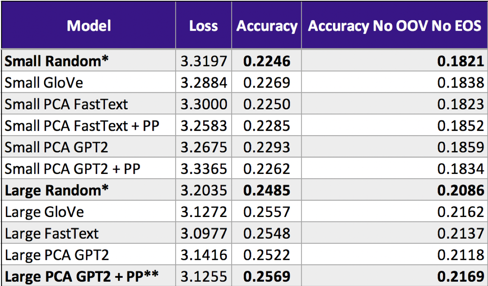

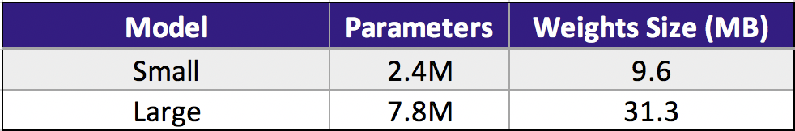

We highlight the large network GPT2 word embeddings (denoted **) with reduced dimension via the Dimensionality Reduction Algorithm as the best performing approach in terms of accuracy, both with and without end of sentence and out of vocab tokens.

### Federated Fine-Tuning Using a Pretrained Model with Pretrained Word Embeddings
As both model pretraining and starting with pretrained word embeddings provide ways of kicking off federated training with more intelligent models, it is natural to combine the two approaches.  In doing so we observed that even with the best of our word embedding approaches, the pretrained model (50 pretraining rounds with 800 rounds of fine-tuning) performed worse than starting with federated training using both random and pretrained embeddings.

We suspect that while pretraining with Shakespeare is effective for the small network, using a model with increased capacity renders this prior information useless, as the nature of Shakespearean English is quite different from that of Stack Overflow.  In this way we think that a dataset more similar to Stack Overlow may yield increased performance for full model pretraining. 

### Comparison to "Adapative Federated Averaging" Stack Overflow Baseline
Our pretraining experiments fixed the client sample size and model architecure as described earlier, though to demonstrate robustness, we explore whether or not the successes we observe with pretraining, particularly using pretrained word embeddings with the Dimensionality Reduction Algorithm, will still hold with a different federated client sample size and model architecure.  In [[10]](https://arxiv.org/pdf/2003.00295.pdf), Reddi et al. sample 50 clients per training round with a max of only 128 text samples instead of 5,000 as in our experiments.  They also use an embedding dimension of size 96 with an LSTM layer of size 670, feeding to two dense layers of size 96 and 10,004 respectively.  With this approach we compare randomly initialized word embeddings to our best performing pretrained word embeddings: GPT2 with dimensionality reduction as in [[8]](https://www.aclweb.org/anthology/W19-4328.pdf). 

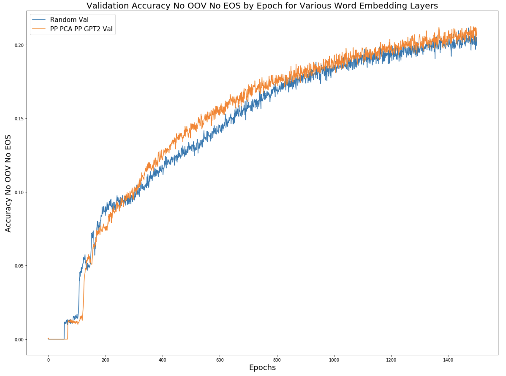

We find that pretrained word embeddings generally outperform random embeddings across 1,500 rounds of training with evaluation on 10,000 validation samples per training round and a final evaluation performed by averaging the last 100 rounds of validation accuracy without special tokens.  While we demonstrate improvement over this baseline architecture using the same training and evaluation design from [[10]](https://arxiv.org/pdf/2003.00295.pdf), we do not realize the same level of accuracy as the paper which achieves 22.1%, and 22.2% with Adam and Yogi optimizers respectively, as in our experiments we use only the default learning rates for Adam.  Future work would apply adapative learning rate methods as in [[10]](https://arxiv.org/pdf/2003.00295.pdf) to both embedding approaches to see if pretrained embeddings continue to outperform random.

### Conclusions and Future Work
While our initial research demonstrates the possibility of reducing the number of federated training rounds required to achieve acceptable model accuracy through the use of pretrained word embeddings, there is much left to explore, particularly for central pretraining with federated fine-tuning, for which we demonstrate a viable procedure but do not achieve performance greater than the federated training baseline. That said, this approach may be fruitful with pretraining data more similar to Stack Overflow than the collected works of Shakespeare.  Also, for both model pretraining and pretrained word embedding approaches, the adaptive learning rate method as in [[10]](https://arxiv.org/pdf/2003.00295.pdf) may help address the specific optimization requirements of fine-tuning weights that have already undergone some training.  Additionally, using federated simulation to conduct pretraining, such that the initial model weights are learned on non-IID datasets, may improve overall model performance after federated fine-tuning.  Simulating federated training conditions to pretrain word embeddings may also yield improved downstream performance by tailoring word representations to reflect different usage across non-IID datasets.  Finally, while GPT2 and other Transformer-based models are achieving state of the art performance on centralized language modeling tasks, the sizes of these models are prohibitively large for federated training and prediction.  While leveraging the embeddings learned from these models for federated training can be immediately useful, as demonstrated here, the ability to reduce the size of these models and train them end to end in the federated setting would likely yield state of the art results for federated next word prediction and other natural language understanding tasks.  Meanwhile, our current research offers effective yet inexpensive improvements, particularly through the use of pretrained word embeddings, and also paves the way for more rigorous transfer learning experiments for federated learning.  

### References
This project draws mainly from the following research, but other code sources are referenced throughout [this repository](https://github.com/federated-learning-experiments/fl-text-models).

-	[1] H. Brendan McMahan, Eider Moore, Daniel Ramage, Seth Hampson, Blaise Aguera y Arcas. [“Communication-Efficient Learning of Deep Networks."](https://arxiv.org/pdf/1602.05629.pdf) Accessed December 6, 2019.
- [2] Keith Bonawitz, Hubert Eichner, Wolfgang Grieskamp, Dzmitry Huba, Alex Ingerman, Vladimir Ivanov, Chloe Kiddon, Jakub Konecny, Stefano Mazzocchi, H. Brendan McMahan, Timon Van Overveldt, David Petrou, Daniel Ramage, Jason Roselander. [“Towards Federated Learning at Scale: System Design.”](https://arxiv.org/pdf/1902.01046.pdf) Accessed December 6, 2019.
- [3] Andrew Hard, Kanishka Rao, Rajiv Mathews, Swaroop Ramaswamy, Francoise Beaufays Sean Augenstein, Hubert Eichner, Chloe Kiddon, Daniel Ramage. [“Federated Learning for Mobile Keyboard Prediction.”](https://arxiv.org/pdf/1811.03604.pdf) Accessed December 6, 2019.
- [4] Jeffrey Pennington, Richard Socher, and Christopher D. Manning. ["GloVe: Global Vectors for Word Representation."](https://nlp.stanford.edu/pubs/glove.pdf) Accessed February 1, 2020.
- [5] Piotr Bojanowski, Edouard Grave, Armand Joulin, Tomas Mikolov. ["Enriching Word Vectors with Subword Information."](https://arxiv.org/pdf/1607.04606.pdf) Accessed February 17, 2020.
- [6] Alec Radford, Jeffrey Wu, Rewon Child, David Luan, Dario Amodei, Ilya Sutskever. ["Language Models are Unsupervised Multitask Learners."](https://cdn.openai.com/better-language-models/language_models_are_unsupervised_multitask_learners.pdf) Accessed February 27, 2020.
- [7] Jiaqi Mu, Pramod Viswanath ["All-but-the-Top: Simple and Effective Postprocessing for Word Representations."](https://openreview.net/forum?id=HkuGJ3kCb)  Accessed March 05, 2020.
- [8] Vikas Raunak, Vivek Gupta, Florian Metze. ["Effective Dimensionality Reduction for Word Embeddings."](https://www.aclweb.org/anthology/W19-4328.pdf) Accessed March 05, 2020.
- [9] Vikas Raunak, Vaibhav Kumar, Vivek Gupta, Florian Metze. ["On Dimensional Linguistic Properties of the Word Embedding Space."](https://arxiv.org/pdf/1910.02211.pdf) Accessed February 27, 2020.
- [10] Sashank J. Reddi, Zachary Charles, Manzil Zaheer, Zachary Garrett, Keith Rush, Jakub Konecný, Sanjiv Kumar, H. Brendan McMahan. ["Adaptive Federated Optimization."](https://arxiv.org/pdf/2003.00295.pdf) Accessed March 6, 2020.
- [11] Thomas Wolf, Lysandre Debut, Victor Sanh, Julien Chaumond, Clement Delangue, Anthony Moi, Pierric Cistac, Tim Rault, Rémi Louf, Morgan Funtowicz, Jamie Brew. ["HuggingFace's Transformers: State-of-the-art Natural Language Processing."](https://arxiv.org/abs/1910.03771)  Accessed March 05, 2020.
- [12] S. Hochreiter, J. Schmidhuber. ["Long Short-Term Memory."](https://www.researchgate.net/profile/Sepp_Hochreiter/publication/13853244_Long_Short-term_Memory/links/5700e75608aea6b7746a0624/Long-Short-term-Memory.pdf) Accessed March 13, 2020.
