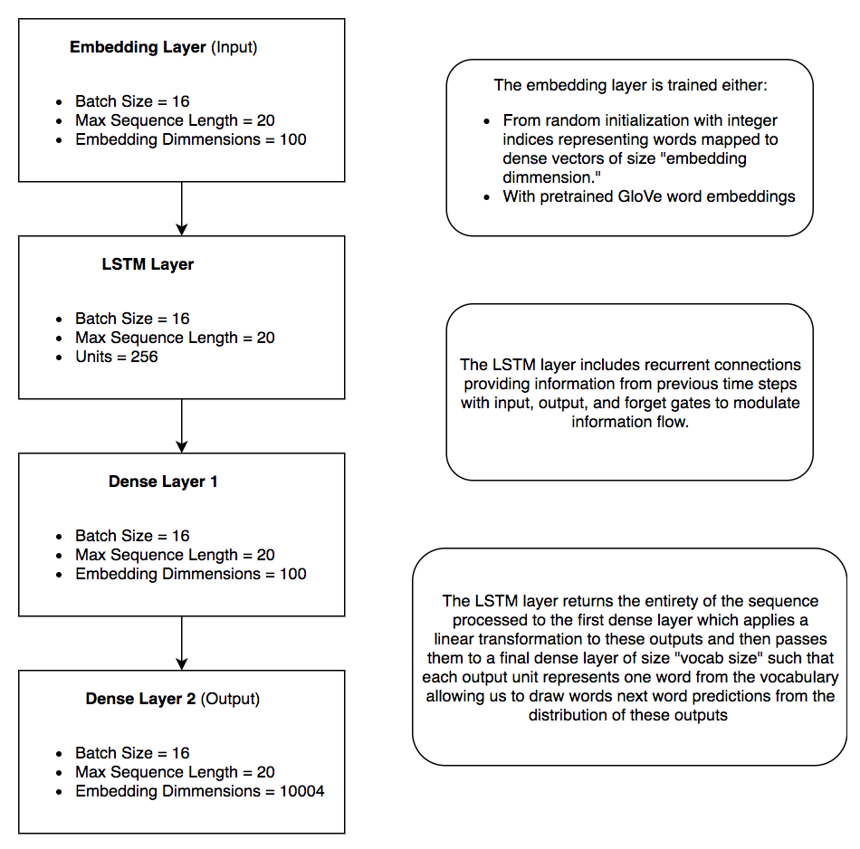
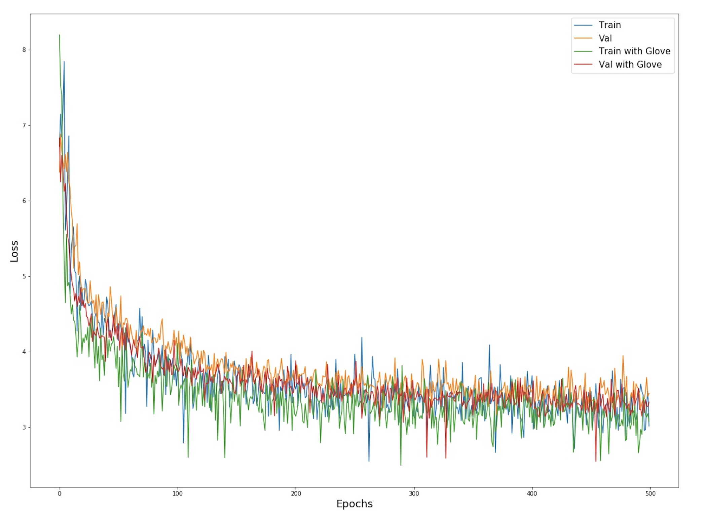
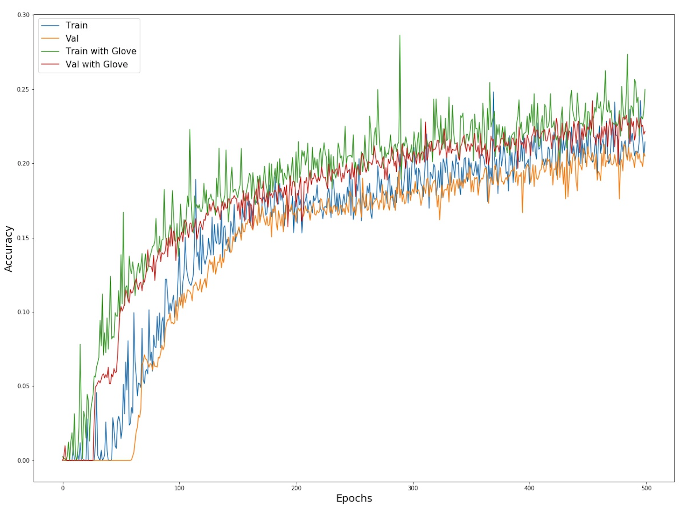

# Interim Research Report
##### DATA 591 at University of Washington in Collaboration with Google

- 01-04-2020
- [Arjun Singh\*](https://github.com/sinarj), [Joel Stremmel\*](https://github.com/jstremme)
- Special thanks to Keith Rush and Peter Kairouz from Google for their guidance throughout the course of this project.  

### Motivation
Machine learning on big data is an extremely popular and useful field of research and development. However, there are a variety of limitations to centrally aggregating data, such as compromising user privacy and the maintenance of often expensive hardware and compute resources.  Federated learning aims to address this and has exhibited promising results for text completion tasks on mobile devices. The [Tensorflow Federated API](https://github.com/tensorflow/federated) provides methods to train federated models and conduct federated learning experiments on data grouped by clients but never aggregated.  Through our research partnership with Google, we aim to build on the existing body of federated learning experiments, focussing on enhancing text models for natural language understanding tasks, such as next word prediction.

### Problem Statement
Federated learning aims to train machine learning models in a distributed fashion without centralizing data but instead updating and passing model parameters from a central server to distributed entities and back to perform stochastic gradient descent.  McMahan et al. propose the Federated Averaging algorithm in ["Communication-Efficient Learning of Deep Networks from Decentralized Data."](https://arxiv.org/pdf/1602.05629.pdf)  Our goal is to replicate the existing network architectures for Federated Averaging, stress testing their limits within our simulated environment. We then aim to apply pretraining and pretrained model layers to measure the impact of starting with learned model weights compared to random initialization for the task of next word prediction on Stack Overflow.  Specifically, in this interim delivery, we measure the effect of using pretrained embeddings on the number of training rounds required to achieve a fixed level of accuracy.

### Data
The main dataset used for these experiments is hosted by Kaggle and made available through the [tff.simulation.datasets module in the Tensorflow Federated API](https://www.tensorflow.org/federated/api_docs/python/tff/simulation/datasets/stackoverflow/load_data).  Stack Overflow owns the data and has released the data under the [CC BY-SA 3.0 license](https://creativecommons.org/licenses/by-sa/3.0/).  The Stack Overflow data contains the full body text of all Stack Overflow questions and answers along with metadata, and the API pointer is updated quarterly.  The data is split into the following sets at the time of writing:

- Train: 342,477 distinct users and 135,818,730 examples.
- Validation: 38,758 distinct users and 16,491,230 examples.
- Test: 204,088 distinct users and 16,586,035 examples.

The [EDA notebook linked here](https://github.com/federated-learning-experiments/fl-text-models/blob/master/eda/stack_overflow_eda.ipynb) contains an exploratory analysis of the data with example records and visualizations.  From this notebook we deduce that challenges with the data include:

- The size of the data, as it would be nearly impossible to inspect all samples.
- The distribution of words.  As is common with text data, the most common words occur with frequency far greater than the least common words (see [Zipf's Law](https://en.wikipedia.org/wiki/Zipf%27s_law)).  Therefore, in our experiments, we limit the vocab size to exclude very rare words, accepting that even state of the art language models fail at next word prediction when the next word is rare.

### Model Design
For this interim delivery, we train two neural networks with four layers each and compare train and validation accuracy at each training round for 500 training rounds by sampling 10 training client datasets per round, each with 5,000 non-IID text samples from Stack Overflow at maximum, and a total of 10,000 validation text samples.  Each of the two models are trained with the Federated Averaging algorithm as in [McMahan et. al.](https://arxiv.org/pdf/1602.05629.pdf)  The model architecure is as follows:

Note in the above that one network starts with a randomly initialized embedding layer while the other starts with [pretrained GloVe embeddings](https://nlp.stanford.edu/projects/glove/) trained on the Wikipedia2015 + Gigaword5 text corpus.  A majority but not all of the words in the Stack Overflow vocabulary have corresponding GloVe embeddings. About 13% of the words do not have a GloVe embedding to begin with, but are learned by the network because we set the embedding layer to "trainable."

### Results
With the model design for the two networks fixed with the exception of the starting embedding layers, we train the model using the Adam optimizer and Sparse Categorical Crossentropy loss, measuring accuracy including out of vocab and end of sentence tokens after each training round on both the sampled training client datasets and the fixed validation set. Note that epochs and training rounds are equivalent as we apply federated averaging after each round as opposed to applying optimization steps on each client dataset for multiple epochs in between training rounds.

#### Model Objective Function at Each Training Round

#### Accuracy at Each Training Round

### Discussion and Next Steps
We observe that even with a relatively small embedding dimension (100 units), the model with pretrained word embeddings results in a lift in accuracy as compared to the model without the pretrained word embeddings, when run for the identical number of epochs. Note there is an element of randomness, because every training round samples posts from 10 Stack Overflow clients/users and the sampled posts will differ between the two model runs. However, due to the large number of posts sampled (up to 5,000 per user) over 500 training rounds, we expect variation in performance due to random sampling to be limited.

We find this result promising and aim to expand on this analysis through more experimentation.  In particular, we aim to measure how pretraining an entire network centrally and fine tuning it in the federated context compares to federated training from scratch and federated training with pretrained word embeddings.  We aim to also explore other model configurations for handling text sequences.

### Schedule Review
Here we include the original schedule from our project proposal and a modified version of that schedule given our work to date.

#### Initial Schedule
January: 

- Familiarize ourselves with the Stack Overflow data and the TFF dataset API for model training
- Replicate LSTM results from the GBoard paper using the Federated Averaging algorithm and work to reduce size and complexity of the LSTM without compromising much on accuracy

February:

- Identify main contributions from reducing LSTM size for federated averaging and finalize experiments with these methods
- Create a Transformer model with federated averaging
- Assess viability of BERT and ALBERT for federated fine tuning

March:

- Compile experimental results
- Create project deliverables
- March 11, 2020 final presentation

#### Revised Schedule
January: 

- Familiarize ourselves with the Stack Overflow data and the TFF dataset API for model training
- Replicate LSTM results from the GBoard paper using the Federated Averaging algorithm and work to reduce size and complexity of the LSTM without compromising much on accuracy

February:

- Identify main contributions from reducing LSTM size for federated averaging and finalize experiments with these methods
- Create an LSTM model with pretrained embeddings and compare to randomly initialized embeddings
- Assess different pretrained word embedding models such as GloVe, FastText, GPT-2 etc
- Pretrain an LSTM model from scratch on a different data souce centrally, and then fine tune in the federated context, comparing to federated training of an LSTM model with pretrained embeddings as well as one with randomly initialized embeddings

March:

- Compile experimental results
- Create project deliverables
- March 11, 2020 final presentation

### Ongoing Challenges
In the data section we highlite a couple of challenges. Additionally, we have found that our experiments quickly drain cloud credits, and we are hopeful that we'll be able to secure more credits in order to execute on the items in our revised schedule. We have also found reconciling standard Tensorflow modeling approaches with the Tensorflow Federated API to be somewhat challenging, as we would like to test a variety of approaches to training language models in the federated context.  That said, we view our analysis and code toward this effort to be one of our primary contributions, and we hope that others find our work instructive for working with text models using the Tensorflow Federated API.

### References
This project draws mainly from the following sources, but other sources are referenced throughout this repository. 

- Tensorflow Federated [API](https://github.com/tensorflow/federated).
-	H. Brendan McMahan, Eider Moore, Daniel Ramage, Seth Hampson, Blaise Aguera y Arcas. [“Communication-Efficient Learning of Deep Networks."](https://arxiv.org/pdf/1602.05629.pdf) Accessed December 6, 2019.
- Keith Bonawitz, Hubert Eichner, Wolfgang Grieskamp, Dzmitry Huba, Alex Ingerman, Vladimir Ivanov, Chloe Kiddon, Jakub Konecny, Stefano Mazzocchi, H. Brendan McMahan, Timon Van Overveldt, David Petrou, Daniel Ramage, Jason Roselander. [“Towards Federated Learning at Scale: System Design.”](https://arxiv.org/pdf/1902.01046.pdf) Accessed December 6, 2019.
- Andrew Hard, Kanishka Rao, Rajiv Mathews, Swaroop Ramaswamy, Francoise Beaufays Sean Augenstein, Hubert Eichner, Chloe Kiddon, Daniel Ramage. [“Federated Learning for Mobile Keyboard Prediction.”](https://arxiv.org/pdf/1811.03604.pdf) Accessed December 6, 2019.
- Jeffrey Pennington, Richard Socher, and Christopher D. Manning. ["GloVe: Global Vectors for Word Representation."](https://nlp.stanford.edu/pubs/glove.pdf) Accessed February 1, 2020.

